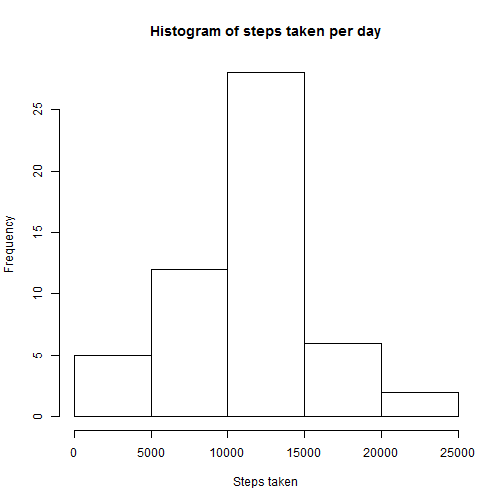
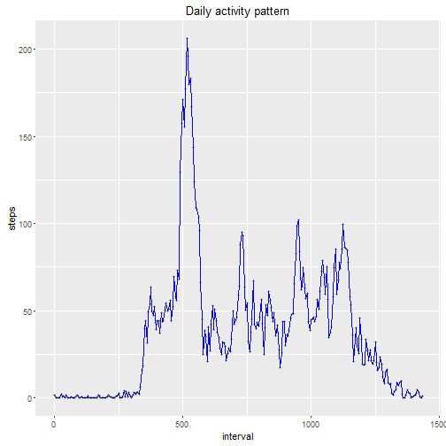
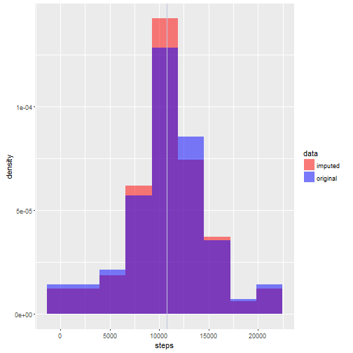
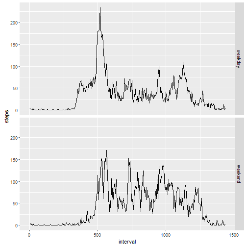

Reproducible Research - Course Project 1
==========================================

This is my submission for the first course project of Reproducible Research course.

## Loading and preprocessing the data

First thing to do is to read csv containing the data. If the data is not 
downloaded and unzipped we have to download and unzip it first.


```r
zipFileName <- "repdata_data_activity.zip"
csvName <- "activity.csv"

if(!file.exists(csvName)) {

  if(!file.exists(zipFileName)) {
    fileUrl <- "https://d396qusza40orc.cloudfront.net/repdata%2Fdata%2Factivity.zip"
    download.file(fileUrl, destfile = zipFileName)
  }

  unzip(zipFileName)

}

stepData <- read.csv(csvName)
```

Second, data must be processed into a format suitable for analysis. Date field
is transformed as date data type and minutes of the intervals are edited more
intuitive.


```r
stepData$date <- as.Date(stepData$date)
stepData$interval <- seq(0, 1435, 5)
```

## Mean total number of steps taken per day

Total number of the steps taken per day are calculated and saved to the
variable called stepsByDate. Dates including NA values are getting sum NA as
na.rm is set to FALSE.


```r
stepsByDate <- aggregate(stepData$steps, by = list(stepData$date), FUN = sum)
## Editing column names
colnames(stepsByDate) <- c("date","steps")
```

Histogram of the results is presented here:

```r
hist(stepsByDate$steps, main = "Histogram of steps taken per day", xlab = "Steps taken")
```



Mean and median of the steps taken is:


```r
mean(stepsByDate$steps, na.rm = T)
```

```
## [1] 10766.19
```

```r
median(stepsByDate$steps, na.rm = T)
```

```
## [1] 10765
```

## Average daily activity pattern

For this task the data must be processed as the form where date is dropped and 
the mean is calculated for each time interval. NA values are removed by na.rm 
since otherwise all the intervals would get NA value.


```r
meanOfIntervals <- aggregate(stepData$steps, by = list(stepData$interval), 
                                FUN = mean, na.rm = T)
colnames(meanOfIntervals) <- c("interval", "steps")
```

Then, time series are drawn from data. I use ggplot2 package which is first
installed and loaded if necessary.


```r
if(!require("ggplot2"))
  install.packages("ggplot2")

library(ggplot2)

ggplot(meanOfIntervals, aes(interval, steps)) + geom_line(color = "blue") +
       geom_point(alpha = 0.20, size = 1) + ggtitle("Daily activity pattern")
```



In the plot you can see that interval somewhere around 500 contains maximum number of steps. Let's check exact interval with R:


```r
cat("Interval that contains maximum number of steps on average is", 
      meanOfIntervals[meanOfIntervals$steps == max(meanOfIntervals$steps), ]$interval)
```

```
## Interval that contains maximum number of steps on average is 515
```

## Imputing missing values

Checking number of the rows containing NA values with complete.cases() function.


```r
cat("Number of rows containing NA values is", sum(!complete.cases(stepData)))
```

```
## Number of rows containing NA values is 2304
```

Next, i'm checking if imputing missing values will change analysis. I'm using mice package for imputing missing values. Even though it may be a bit over sophisticated for this project, I see this as opportunity to practice imputing methods. First mice package must be installed and loaded if this is not done earlier. Then variables are converted to numeric since imputing method "pmm" requires that. I don't see that as a problem since dates are easily converted to numeric. After that mice will handle imputing.


```r
if(!require("mice"))
  install.packages("mice")

library(mice)

completedData <- data.frame("steps" <- as.numeric(stepData$steps), 
                            "date" <- as.numeric(stepData$date),
                            "interval" <- as.numeric(stepData$interval))

## normally more data sets (m) and iterations (maxit) would be considered but it would take more time.
completedData <- mice(completedData, m=1, maxit = 5, meth = "pmm")
```

```
## 
##  iter imp variable
##   1   1  X.steps.....as.numeric.stepData.steps.
##   2   1  X.steps.....as.numeric.stepData.steps.
##   3   1  X.steps.....as.numeric.stepData.steps.
##   4   1  X.steps.....as.numeric.stepData.steps.
##   5   1  X.steps.....as.numeric.stepData.steps.
```

```r
completedData <- complete(completedData, 1)

## Processing data back to valid format.
colnames(completedData) <- colnames(stepData)
completedData$date <- as.Date(completedData$date, origin = "1970-01-01")
```

Then we can compare original data with NAs to data with imputed values. I do this with overlaying histograms where red bar is indicating data with imputed values, blue bar is indicating original data, red vertical line indicates mean and pink line median of the data with imputed values and blue vertical line indicates mean and sky blue median of the original data.


```r
## First, data must be processed and merged to one data frame
stepsByDateWhole <- aggregate(completedData$steps, by = list(completedData$date), FUN = sum)
colnames(stepsByDateWhole) <- c("date","steps")
stepsByDateWhole$data <- rep("imputed", nrow(stepsByDateWhole))
stepsByDate$data <- rep("original", nrow(stepsByDate))
stepsByDateWhole <- rbind(stepsByDateWhole, stepsByDate[complete.cases(stepsByDate),])


## Histogram drawing
ggplot(data = stepsByDateWhole, aes(x = steps, fill = data, alpha = 0.5)) + 
geom_histogram(alpha = 0.5, aes(y = ..density..), position = "identity", bins = 9) +
  
## Setting fill color palette manually
scale_fill_manual(values = c("red", "blue")) +
  
## Lines for means
geom_vline(xintercept = mean(stepsByDateWhole[stepsByDateWhole$data == "imputed",]$steps), color = "red") + 
geom_vline(xintercept = mean(stepsByDateWhole[stepsByDateWhole$data == "original",]$steps, na.rm = T), color = "blue") + 

## Lines for medians  
geom_vline(xintercept = median(stepsByDateWhole[stepsByDateWhole$data == "imputed",]$steps), color = "pink") +
geom_vline(xintercept = median(stepsByDateWhole[stepsByDateWhole$data == "original",]$steps, na.rm = T), 
           color = "skyblue", alpha = 0.5)
```



As you can see in the original data mean and median is overlapping and color of the line is something middle of the blue and sky blue. Both median and mean are slightly higher in original data than in data with imputed values. 

Imputed data lowers slightly average steps taken in a day. It also seems to little reduce variance as most imputed values seems to be in the middle of the histogram.

Here is mean and the median from both of the data sets.

First mean with imputed values:

```r
mean(stepsByDateWhole[stepsByDateWhole$data == "imputed",]$steps)
```

```
## [1] 10762.28
```
Second mean from original data:

```r
mean(stepsByDateWhole[stepsByDateWhole$data == "original",]$steps, na.rm = T)
```

```
## [1] 10766.19
```
Third median from imputed data:

```r
median(stepsByDateWhole[stepsByDateWhole$data == "imputed",]$steps)
```

```
## [1] 10765
```
Finally median from original data:

```r
median(stepsByDateWhole[stepsByDateWhole$data == "original",]$steps, na.rm = T)
```

```
## [1] 10765
```


## Patterns between weekdays and weekends

First I create weekend variable which indicates is given date weekend or weekday. For that I must ensure that locales are set in English.


```r
## Setting locale to English as I use English weekdays
Sys.setlocale("LC_ALL", "English")
```

```
## [1] "LC_COLLATE=English_United States.1252;LC_CTYPE=English_United States.1252;LC_MONETARY=English_United States.1252;LC_NUMERIC=C;LC_TIME=English_United States.1252"
```

```r
## Searching weekends
completedData$weekend <- sapply(completedData$date, function(x) {
  
  x <- weekdays(x)
  
  if(x == "Saturday" | x == "Sunday")
    return(1)
  else
    return(0)
}
)

## Converting weekend variable as a factor
completedData$weekend <- factor(completedData$weekend, levels = c(0,1), labels = c("weekday","weekend"))
```
Then with the new variable it is possible to search weekday patterns versus weekends. I use reshape2 package for reshaping the data.


```r
if(!require("reshape2"))
  install.packages("reshape2")
library(reshape2)

completedMelt <- melt(completedData[,c(1,3,4)], id = c("interval","weekend"))
completedMelt <- dcast(completedMelt, interval + weekend ~ variable, mean)

ggplot(completedMelt, aes(x = interval, y = steps)) + geom_line() + facet_grid(weekend ~ .)
```



As we can see, in the weekdays there is a peak during early working hours (around 8 o'clock) after that number of steps reduces. During weekends (plot below) the peak is much flatter. However, in the weekends it seems that steps are more divided during the day. In the weekdays there is less steps during afternoon and evening.
